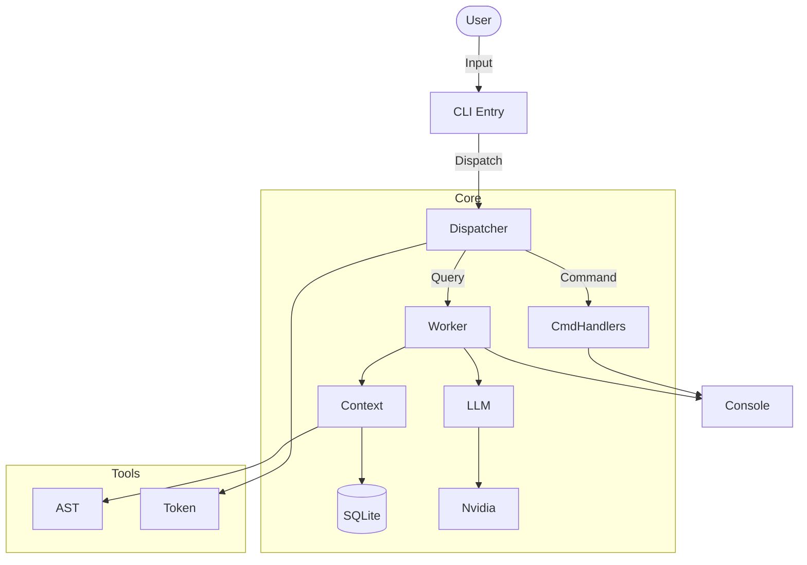

# 🧠 AI Assistant CLI V2

**AI Assistant CLI V2** is an intelligent, context-aware command-line tool designed for efficient codebase analysis and research. It leverages NVIDIA's AI endpoints (powering models like Llama 3.1 405b) to provide accurate answers about your code, utilizing AST-based summarization to maximize context window efficiency. ai stuff, slop code.


## ✨ Features

- **Context-Aware Research**: Intelligently manages context tokens by loading AST summaries of files by default, only loading full content when necessary.
- **Smart Caching**: Implements a persistent caching layer (SQLite) to reduce API costs and latency for repeated queries.
- **Interactive REPL**: A rich, colorful command-line interface powered by `rich` and `click`.
- **Session Analytics**: Track token usage, cache hit rates, and query performance in real-time.
- **High-Performance**: Optimized for speed with parallel processing and efficient storage handling.

## 🚀 Installation

### Prerequisites

- Python 3.10 or higher
- An NVIDIA API Key (Get one [here](https://build.nvidia.com/))

### Setup

1. **Clone the repository:**

   ```bash
   git clone https://github.com/yourusername/ai-assist-v2.2.git
   cd ai-assist-v2.2
   ```

2. **Install dependencies:**
   Using `pip`:

   ```bash
   pip install -r requirements.txt
   ```

   Or using `uv` (recommended):

   ```bash
   uv sync
   ```

3. **Configure Environment:**
   Create a `.env.local` file in the root directory:
   ```bash
   cp .env.example .env.local  # If .env.example exists, otherwise create new
   ```
   Add your API key:
   ```ini
   NVIDIA_API_KEY=nvapi-your-key-here
   # Optional overrides
   # MAX_CONTEXT_TOKENS=7000
   # LOG_LEVEL=INFO
   ```

## 🎮 Usage

Start the CLI application:

```bash
python main.py
```

### Commands

| Command                 | Description                                                                      |
| ----------------------- | -------------------------------------------------------------------------------- |
| `/load <file> [--full]` | Load a file into context. Defaults to AST summary. Use `--full` for raw content. |
| `/unload <file>`        | Remove a specific file from context.                                             |
| `/list`                 | Show all currently loaded files and their token usage.                           |
| `/context`              | Display current context saturation (tokens used vs max).                         |
| `/stats`                | Show session analytics (cache hits, total tokens, query count).                  |
| `/clear --all`          | Clear the entire context.                                                        |
| `/help`                 | Display the help menu.                                                           |
| `/exit`                 | Exit the application.                                                            |

### Example Workflow

```text
> /load core/dispatcher.py
✓ Loaded core/dispatcher.py (Summary, 450 tokens)

> /load utils/logger.py --full
✓ Loaded utils/logger.py (Full Content, 1,200 tokens)

> How does the dispatcher route commands?
(The AI analyzes the loaded context and provides an answer...)
```

## ⚙️ Configuration

The application is configured via environment variables.

| Variable             | Default                        | Description                                     |
| -------------------- | ------------------------------ | ----------------------------------------------- |
| `NVIDIA_API_KEY`     | **Required**                   | Your NVIDIA API key.                            |
| `DEFAULT_MODEL`      | `meta/llama-3.1-405b-instruct` | The LLM model to use.                           |
| `MAX_CONTEXT_TOKENS` | `7000`                         | Maximum tokens allowed in the context window.   |
| `CACHE_ENABLED`      | `true`                         | Enable/disable SQLite response caching.         |
| `CACHE_TTL`          | `3600`                         | Time-to-live for cached responses (in seconds). |
| `DB_PATH`            | `data/ai_assistant.db`         | Path to the SQLite database.                    |

## 🏗️ Architecture & Design

The system is built on a modular architecture designed for extensibility and separation of concerns.

### System Flow



### Key Components

1.  **Dispatcher (`core/dispatcher.py`)**: The central nervous system. It initializes the environment and routes user input to either command handlers (for `/load`, etc.) or the Research Worker (for questions).
2.  **Context Manager (`core/context_manager.py`)**: Manages the "working memory" of the AI. It decides whether to load a lightweight AST summary or the full file content to optimize token usage.
3.  **Research Worker (`workers/research_worker.py`)**: Orchestrates the answering process. It constructs the prompt using loaded context, queries the LLM, and caches the result.
4.  **AST Summarizer (`tools/ast_summarizer.py`)**: A static analysis tool that parses Python code to extract classes, functions, and docstrings, creating a token-efficient summary.

---

## 🤝 Contributing

Contributions are welcome! Please ensure you run tests before submitting a PR.

```bash
pytest tests/
```

## 📄 License

This project is licensed under the MIT License - see the [LICENSE](LICENSE) file for details.
